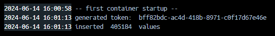

# project-data-engineering

- Phase 1: [Conception Phase - Task 1](./Conception%20Phase%20-%20Task%201.pdf)
- Phase 2: [Development Phase/Reflection Phase - Task 2](./Development%20Phase%20-%20Reflection%20Phase%20-%20Task%201.pdf)

## build and run

1. run ``docker compose up -d`` in root folder to start the project as a new docker container
    - if ``docker compose`` errors out with ``error getting credentials - err: exec: "docker-credential-desktop": executable file not found in %PATH%, out: ''`` -> change **credsStore** to **credStore** in ``%USERPROFILE%/.docker/config.json`` on windows or ``$HOME/.docker/config.json`` on linux
    - the python container runs on the **first** start only and loads the sample data into the database, to remove the data and reset the projects use ``docker compose down --volumes``
    - **a access token is generated by the python script and printed to the docker terminal of the python image** \
    
    - the generated token can be used to test the endpoints with swagger ui or by calling plain get requests to the endpoints
2. services available
    - api on port 6500
    - database on port 6501 -> USER=postgres, PASSWORD=postgres, DB=data-system-db
    - api-documentation is available [here](http://localhost:6500/swagger) when the container is running

## routes

| route | type | parameter | optional parameter |
|:---|:---:|:---|:---|
|/v1/data/latest|GET|AuthorizationToken: string|DeviceId: string Count: int -> [1...100...500]|
|/v1/data|GET|AuthorizationToken: string DeviceId: string -> stringified mac address|PageIndex: int -> 0 PageSize: int -> [1...25...100] Order: string -> "ascending", "descending" OrderValue: string -> "timestamp", "humidity", "carbondioxide", "lpg", "temperature", "smoke", "light", "motion"|
|/v1/data|POST|AuthorizationToken: string TimeStamp: string -> stringified datetime DeviceId: string -> stringified mac address|CarbonDioxide: double? Humidity: double? Light: bool? Lpg: double? Motion: bool? Smoke: double? Temperature: double? AdditionalData: string -> JSON|

the [dataset](https://www.kaggle.com/datasets/garystafford/environmental-sensor-data-132k) is licensed under [CC0: Public Domain License](https://creativecommons.org/publicdomain/zero/1.0/) while this repository is licensed under [MIT License](./LICENSE)
