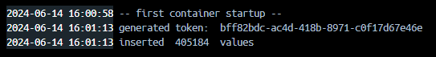

# project-data-engineering

- Phase 1: [Conception Phase - Task 1](./Lohmar-Lukas_UPS10667514_DataEngineering_P1_S.pdf)
- Phase 2: [Development Phase/Reflection Phase - Task 1](./Lohmar-Lukas_UPS10667514_DataEngineering_P2_S.pdf)
- Phase 3: [Finalization Phase - Task 1](./Lohmar-Lukas_UPS10667514_DataEngineering_P3_S.pdf)

## build and run

1. run ``docker compose up -d`` in root folder to start the project as a new docker container
    - if ``docker compose`` errors out with ``error getting credentials - err: exec: "docker-credential-desktop": executable file not found in %PATH%, out: ''`` -> change **credsStore** to **credStore** in ``%USERPROFILE%/.docker/config.json`` on windows or ``$HOME/.docker/config.json`` on linux
    - depending on OS or distribution ``docker compose`` is not a known command and/or aliased to ``docker-compose``
    - the python container runs on the **first** start only and loads the sample data into the database, to remove the data and reset the projects use ``docker compose down --volumes``
    - **a access token is generated by the python script and printed to the docker terminal of the python image** \
    
2. services available
    - web-api on port 6500
    - grpc on port 6501
    - database on port 6505 -> USER=postgres, PASSWORD=postgres, DB=data-system-db
    - api-documentation is available [here](http://localhost:6500/swagger) when the container is running
3. execute requests on the api
    - every reqest needs a generated access token
    - test web-api with [swagger](http://localhost:6500/swagger), enum values are generated inconsistent and its recommended to test the grpc-endpoint with gRPCui
    - start gRPCui with ``docker run --rm -p :6504:8040 fullstorydev/grpcui:v1.4.1 -port 8040 -plaintext host.docker.internal:6501``, the service is avaiable [here](http://localhost:6504)

the [dataset](https://www.kaggle.com/datasets/garystafford/environmental-sensor-data-132k) is licensed under [CC0: Public Domain License](https://creativecommons.org/publicdomain/zero/1.0/) while this repository is licensed under [MIT License](./LICENSE)
